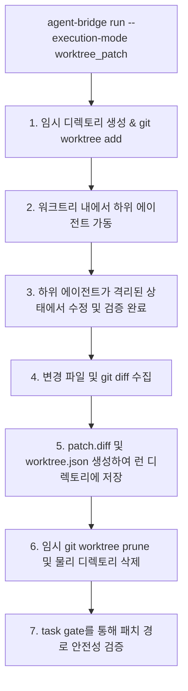

# Option A: Isolated Git Worktree Execution Plan

이 문서는 `agent-bridge run` 실행 시 하위 에이전트가 메인 작업 공간(Active Working Tree)을 오염시키지 않고, 안전하게 임시 격리 공간에서 코드를 수정 및 검증할 수 있도록 지원하는 **쓰기 가능(Write-capable) 워크트리 격리 실행 엔진**의 상세 설계 방안을 명시합니다.

---

## 1. 아키텍처 개요

기존 `report` 모드와 달리, 하위 에이전트가 코드를 직접 수정하는 `worktree_patch` 모드 태스크에서는 메인 저장소와 격리된 임시 Git 워크트리를 생성하여 실행합니다.

---

## 2. 세부 구현 방안

### A. 워크트리 생명주기 관리 (`src/agent_bridge/worktrees.py` 연동)
이미 구현되어 있는 `worktrees.py` 모듈을 `runs.py` 및 `cli.py` 내의 `execute_mock_run` (또는 실제 구동부)에 접목합니다.

1. **워크트리 추가 (Provisioning)**:
   * 메인 프로젝트의 `.git`을 공유하는 독립적인 워크트리를 시스템 임시 폴더(`tempfile.gettempdir()`) 하위에 고유한 이름으로 생성합니다.
   * `git worktree add <temp_path> <branch_or_commit>` 명령을 호출합니다.
2. **에이전트 구동 및 Cwd 전환**:
   * CLI 어댑터(`CliAdapterRunner`)를 실행할 때, 하위 프로세스의 작업 디렉토리(`Cwd`)를 메인 작업 공간이 아닌 새로 생성된 **임시 워크트리 경로**로 전환하여 실행합니다.
   * 이로 인해 하위 에이전트가 `write_file` 이나 `replace_file_content` 같은 쓰기 도구를 사용해 파일을 수정하더라도 메인 작업 공간의 소스코드는 전혀 침범받지 않습니다.
3. **변경사항 수집 및 패치 추출 (Patch Export)**:
   * 에이전트 구동 완료 후, `git add -A` 및 `git diff --cached --binary` 명령어를 통해 격리 구역 안에서 변경되거나 새롭게 추가된 모든 파일(Untracked 포함)을 단일 바이너리 패치 파일인 `patch.diff`로 내보냅니다.
   * 수정된 파일 목록 및 커밋 해시 등을 구조화한 `worktree.json`을 생성합니다.
4. **Pruning & Cleanup (안전 장치)**:
   * 패치 추출이 끝나면 에이전트의 성공/실패 여부와 관계없이 `try ... finally` 블록을 활용하여 `git worktree remove --force <temp_path>`를 수행하고, 남은 찌꺼기 파일들을 완벽히 Pruning합니다.
   * 만약 에이전트 실행 도중 강제 종료되거나 예외가 발생하더라도, Pruning이 누락되어 로컬 Git 메타데이터가 꼬이지 않도록 견고한 예외 수거 처리를 설계합니다.

---

## 3. 정밀 핸들링 및 안전 게이트

* **패치 경로 예외 검증 (Path Safety Gate)**:
  * 생성된 `patch.diff`의 수정 파일 경로들을 파싱하여 `task_spec.v0`에 기재된 `write_scope` 범위에 정확히 부합하는지 1차로 기계적 필터링을 거칩니다.
  * 만약 에이전트가 쓰기 허용 범위 밖의 파일을 하나라도 터치한 흔적이 발견되면, **Commander Review 단계로 넘기지 않고 즉시 Reject 및 Block 처리**합니다.
* **빈 패치(Empty Patch) 처리**:
  * 단순 리포트나 탐색 목적의 태스크일 경우, 빈 패치를 허용하되 쓰기 목적 태스크인 경우에는 경고 혹은 partial 처리하도록 유연한 플래그(`allow_empty_patch`)를 둡니다.

---

## 4. 로드맵 및 검증 계획

1. **1단계**: `runs.py`에 `--execution-mode` 파싱 및 `worktree` 프로비저닝 로직 통합.
2. **2단계**: CLI 어댑터 실행 시 Cwd를 임시 워크트리로 교체 적용.
3. **3단계**: `patch.diff` 및 `worktree.json` 물리 아티팩트를 런 디렉토리에 강제 자동 저장.
4. **4단계**: 격리 실행 스모크 테스트 및 `task gate` 통과 확인.
