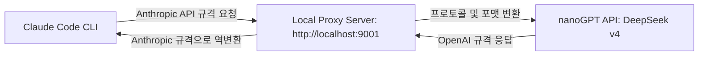

# Option C & D: Alternative Agent Harness & Claude Code Customization Proposal

이 문서는 OpenCode의 최신 모델 등록 부재 문제를 해결하고, nanoGPT에서 무상 제공하는 대용량 토큰 쿼터(DeepSeek v4 Pro/Flash, Mimo v2.5 Pro)를 활용해 하위 에이전트가 파일 구조를 안전하게 분석하고 수정할 수 있도록 지원하는 **커스텀 에이전트 하네스 및 Claude Code 우회 연동 방안**을 제시합니다.

---

## 1. OpenAI 호환 API 최신 모델 Harness 탐색 (옵션 C)

OpenCode 어댑터를 거치지 않고, 직접 `NANOGPT_API_KEY`를 사용해 파일 인프라 제어가 가능한 에이전트를 가동하는 두 가지 최선의 방법입니다.

### A. Aider CLI 에이전트 융합 (강력 추천)
* **개요**: Aider는 Git 커밋 자동화, 뛰어난 파일 변경 감지(Map), 롤백 기능을 내장한 대표적인 오픈소스 AI 코딩 CLI입니다. OpenAI API 및 다양한 커스텀 API를 기본 지원합니다.
* **nanoGPT 연동 방식**:
  * nanoGPT는 OpenAI 호환 규격을 제공하므로, 다음과 같이 환경 변수와 실행 명령어를 주면 Aider를 다이렉트로 붙일 수 있습니다.
  ```bash
  export OPENAI_API_BASE="https://nano-gpt.com/api/v1" # 또는 nanoGPT의 공식 API Base
  export OPENAI_API_KEY="your_nanogpt_api_key"
  aider --model openai/deepseek/deepseek-v4-pro
  ```
  * 이 방식은 별도의 코드 변경 없이 검증된 툴-유즈 및 파일 편집 Harness를 즉시 획득할 수 있어 매우 신속하고 견고합니다.

### B. Lightweight Custom Python Harness 구현
* **개요**: 외부 의존성 없이 `agent-bridge` 자체 패키지 내부에 초소형 LLM 루프 스크립트를 구현하는 방안입니다.
* **아키텍처**:
  * `src/agent_bridge/runners/custom_agent.py`를 신설하고 `openai` 패키지 또는 `urllib`를 이용해 직접 nanoGPT API를 호출합니다.
  * System Prompt에 프로젝트 파일 목록(`list_dir`) 및 파일 조회/수정 규칙(XML/JSON 포맷)을 기술하고, LLM의 응답에서 도구 사용을 정규식으로 파싱하여 에이전트 내부적으로 파일 I/O를 직접 처리해 줍니다.
  * 외부 무거운 CLI 라이브러리 없이 완벽한 통제 하에 작동하는 초소형 전용 에이전트가 완성됩니다.

---

## 2. 유출본 Claude Code 커스터마이징 및 Proxy 우회 방안 (옵션 D)

사용자가 복제해둔 Claude Code 유출본 레포를 커스터마이징하여 nanoGPT 및 타사 API(DeepSeek v4, Mimo 등)를 결합하는 고도의 기획안입니다.

### A. 기술적 타당성 검토
1. **환경 변수를 통한 공식 우회 지원**:
   * 최신 조사에 따르면 Claude Code CLI는 기본적으로 Anthropic API Base URL 우회를 지원합니다.
   * `ANTHROPIC_BASE_URL` 환경 변수를 지정하면 오리지널 CLI 소스 코드를 크게 해킹하지 않고도 타사 API 엔드포인트로 통신을 쉽게 유도할 수 있습니다.
2. **모델 매핑**:
   * `ANTHROPIC_DEFAULT_SONNET_MODEL` 환경 변수에 `deepseek-chat` 혹은 `deepseek-reasoner`를 명시하여 CLI 내부의 API 요청 시 모델 규격을 대체하도록 주입할 수 있습니다.

### B. 로컬 프록시(Local Proxy Server) 중계 아키텍처
nanoGPT의 OpenAI/DeepSeek API 규격이 Claude 특유의 API 프로토콜 구조(Messages API, Computer Use, Tool Call Format 등)와 충돌하는 경우를 완벽하게 우회하기 위해 **초소형 로컬 중계 프록시(Python FastAPI 또는 Flask)**를 도입합니다.



1. **프록시 구동**:
   * Python으로 작성된 초경량 로컬 프록시 서버를 기동합니다.
   * 이 서버는 `/v1/messages` 엔드포인트를 열고, 들어오는 Anthropic 규격의 요청을 수신합니다.
2. **프로토콜 변환**:
   * 요청 본문 속의 도구 정의(`tools`), 사용자 메시지(`messages`) 및 시스템 프롬프트 등을 nanoGPT가 지원하는 OpenAI 호환 format(예: `tools` -> `functions` 또는 system prompt 튜닝)으로 번역하여 nanoGPT에 전달합니다.
3. **Claude Code 실행**:
   * 환경 변수를 설정하여 로컬 프록시를 바라보게 지시하고 Claude Code를 가동합니다.
   ```bash
   export ANTHROPIC_BASE_URL="http://localhost:9001/v1"
   export ANTHROPIC_AUTH_TOKEN="dummy_token_or_nanogpt_key"
   export ANTHROPIC_DEFAULT_SONNET_MODEL="deepseek/deepseek-v4-pro"
   claude
   ```
   * 이 우회 프록시 아키텍처를 적용하면, **Claude Code의 고성능 파일 관리 및 자가 치유(Self-healing) 터미널 Harness 엔진을 고스란히 살린 상태로, API 비용 걱정 없는 대용량 nanoGPT의 DeepSeek/Mimo 모델 쿼터를 무제한으로 사용**할 수 있습니다.
